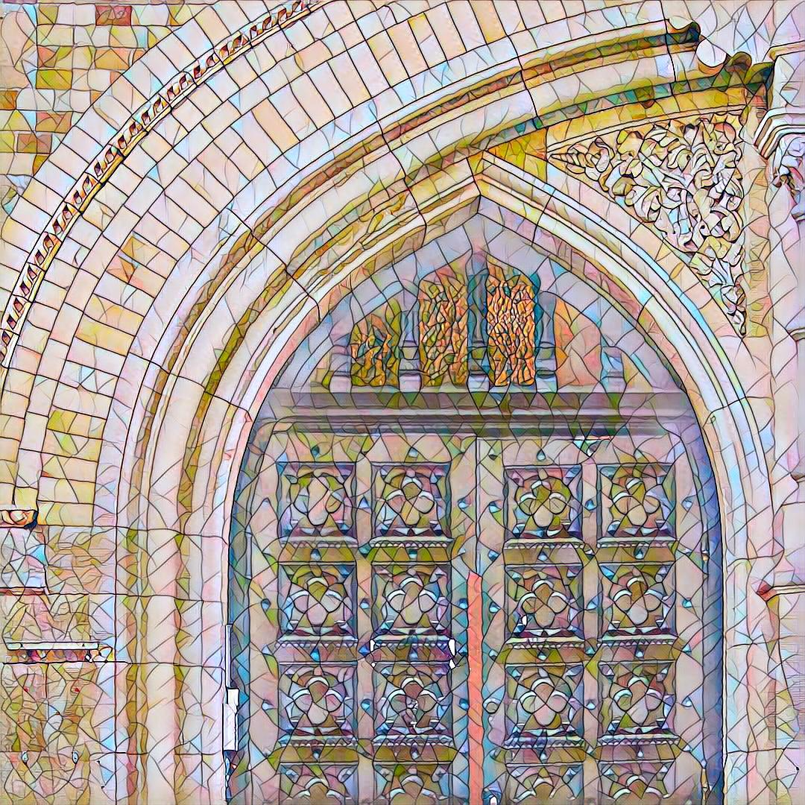
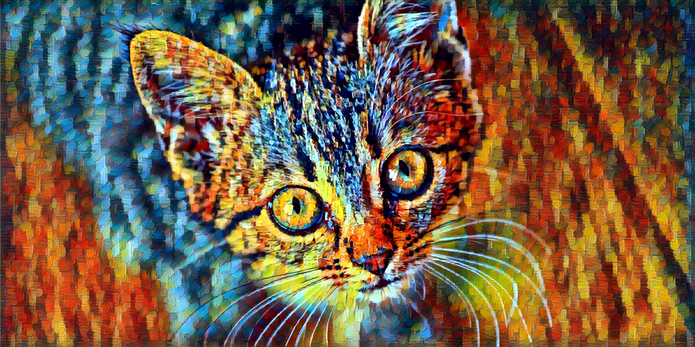

# Style Transfer

Style Transfer is a deep learning project that aims to transfer the style of one image onto another using convolutional neural networks (CNNs). This technique allows you to create artistic and visually appealing images by combining the content of one image with the style of another.

## Overview

This project implements the style transfer algorithm using PyTorch, a popular deep learning framework. It includes the following components:

- **TransformerNet**: Defines the architecture of the neural network responsible for transferring the style.
- **Vgg16**: Provides the pre-trained VGG-16 network for extracting feature maps from the content and style images.
- **Utils**: Contains utility functions for loading and saving images, normalizing batches, and calculating gram matrices.
- **Args Parser**: Parses command-line arguments for training and evaluation/stylizing.

## Getting Started

To get started with Style Transfer, follow these steps:

1. Clone this repository to your local machine.
2. Install the required dependencies using `pip install -r requirements.txt`.
3. Train the style transfer model using the provided datasets and training script.
4. Stylize images using the trained model.

## Usage

### Training

To train the style transfer model, use the following command:

```bash
python main.py train --dataset <path_to_dataset> --style-image <path_to_style_image> --save-model-dir <path_to_save_model>
```

- **--dataset**: Path to the training dataset directory.
- **--style-image**: Path to the style image to transfer.
- **--save-model-dir**: Directory to save the trained model


### Stylizing Images
**(Through Command Line)**
To stylize images using a trained model, use the following command:

```bash
python main.py eval --content-image <path_to_content_image> --output-image <output_image_path> --model <path_to_model>
```
- **--content-image**: Path to the content image to stylize.
- **--output-image**: Path to save the stylized output image.
- **--model**: Path to the trained model('.pth' or '.onxx' format)
**(Through StreamLine)**
To stylize image using a web interface with downloaded model, use the following command:
```bash
streamlit run app.py
```

## Examples
Below are some examples of stylized images created using the Style Transfer model:

**Content-Image**


**Style-Image**
- Amber Style

- Rain Princess Style


## Contribution
This project is open source and welcomes any contribution to fine-tune the model or improve the user experience. You can fork this repository and submit a pull request with your changes. Please follow the code style and documentation guidelines.

## 🔗 Links

[](https://www.linkedin.com/tushaar9560/)
[](https://www.instagram.com/itstushaar1/)
[](https://telegram.com/itstushaar1/)
[](mailto:tushaar.sharma05@gmail.com)